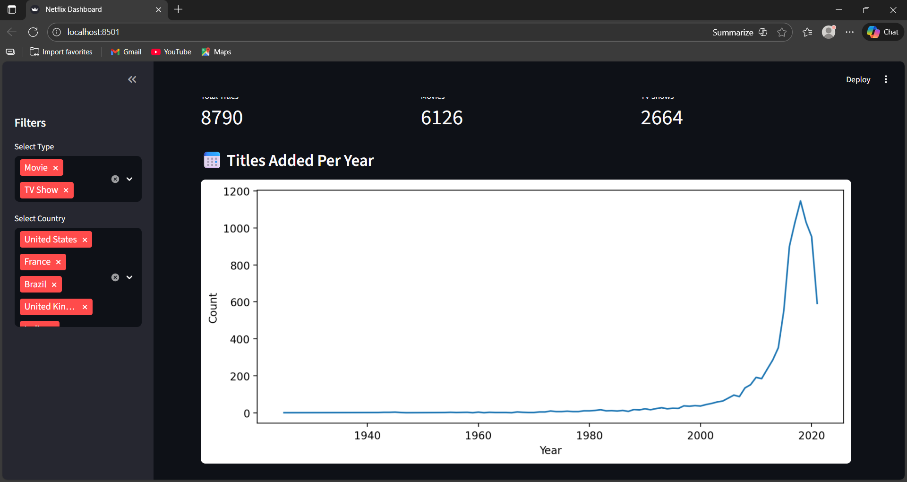
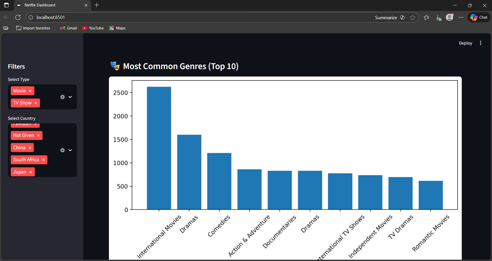
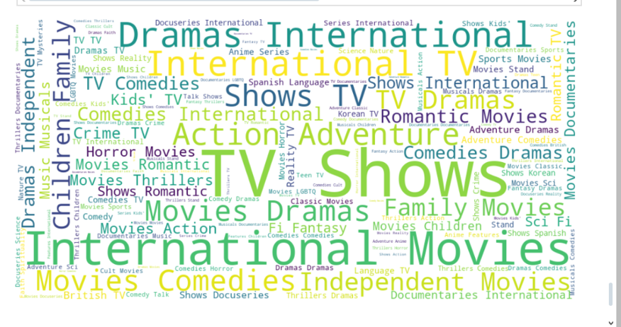

📊 Netflix Data: Cleaning, Analysis & Visualization

Internship Project – Unified Mentor Pvt. Ltd.

Submitted by: B. Archana

---

📌 1. Project Overview

This project focuses on analyzing Netflix’s dataset to understand content trends across movies and TV shows.
It involves:

Data cleaning

Exploratory data analysis (EDA)

Visualizations

Building an interactive Streamlit dashboard

The goal is to derive insights such as top genres, content distribution, yearly trends, and country-wise analysis.

---

📌 2. Dataset Information

Source: Netflix titles dataset

Rows: 8,790

Columns: 12

Includes:

show_id

type (Movie / TV Show)

title

director

country

date_added

release_year

rating

duration

listed_in (Genres)

---

📌 3. Project Folder Structure

NETFLIX-PROJECT/
│
├── data/
│   ├── raw/
│   │   └── netflix1.csv
│   └── clean/
│       └── netflix_cleaned.csv
│
├── notebooks/
│   └── analysis.ipynb
│
├── dashboards/
│   └── app.py
│
├── reports/
│   └── Netflix_Report.md
│
├── requirements.txt
└── venv/

---

📌 4. Data Cleaning Process

✔ Missing Values Handling

Replaced empty director and country fields with “Not Given”

Filled missing dates with most frequent value

Cleaned inconsistent formats

✔ Converted Data Types

date_added → datetime

duration → numeric + unit separated

Cleaned genre strings

✔ Removed duplicates

Duplicate rows were identified and removed

✔ Saved cleaned dataset

data/clean/netflix_cleaned.csv

---

📌 5. Exploratory Data Analysis (EDA)

Below visuals were generated from analysis.ipynb.

---

📌 5.1 Distribution of Movies vs TV Shows

---

📌 5.2 Titles Added Per Year

Netflix drastically increased content after 2015, peaking around 2020.

---

📌 5.3 Top 10 Most Common Genres

International Movies & Dramas dominate the platform.

---

📌 5.4 Word Cloud of All Genres

A word cloud was generated to visualize frequency of genres.

---

📌 6. Interactive Dashboard

A fully interactive dashboard was created using Streamlit.

🎛 Features:

Filter by Type (Movie / TV Show)

Filter by Country

Yearly trend visualization

Genre distribution

Dynamic table view

---

📌 6.1 Dashboard Filters Section

---

📌 6.2 Dashboard Metrics Section

Shows counts of Movies, TV Shows & Total Titles.

---

📌 6.3 Dashboard Visualizations

Includes line charts & bar charts for trends.

---

📌 6.4 Dashboard Table View

Displays filtered Netflix dataset.

---

📌 7. Key Insights

📍 1. Netflix content increased massively after 2015
📍 2. Movies dominate the platform (6126 movies vs 2664 shows)
📍 3. “International Movies” is the most common genre
📍 4. USA, India, UK produce the most content
📍 5. Many entries have missing director names

---

📌 8. Conclusion

This project successfully cleaned, analyzed, visualized, and built an interactive dashboard for the Netflix dataset.
The results offer strong insights for understanding content trends and can be extended into:

Recommendation systems

Country-based insights

Rating-based studies

---

📌 9. Tools Used

Python

Pandas, NumPy

Matplotlib, Seaborn

WordCloud

Streamlit

Jupyter Notebook

---

🎉 Report Completed Successfully